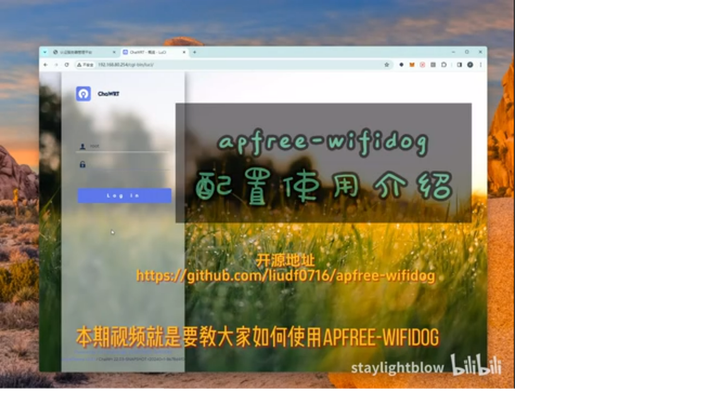
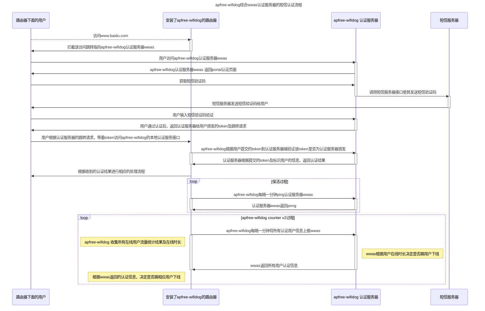
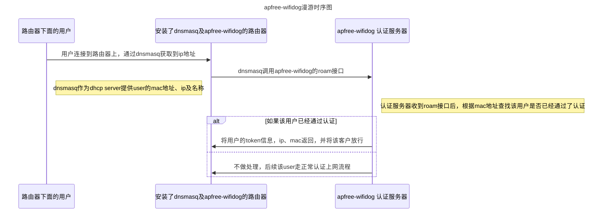

<div align="center">


</div>

[![license][1]][2]
[![PRs Welcome][3]][4]
[![Issue Welcome][5]][6]
[![Release Version][7]][8]
[![OpenWRT][11]][12]
[![Join the QQ Group][15]][16]


[1]: https://img.shields.io/badge/license-GPLV3-brightgreen.svg?style=plastic
[2]: https://github.com/liudf0716/apfree_wifidog/blob/master/COPYING
[3]: https://img.shields.io/badge/PRs-welcome-brightgreen.svg?style=plastic
[4]: https://github.com/liudf0716/apfree_wifidog/pulls
[5]: https://img.shields.io/badge/Issues-welcome-brightgreen.svg?style=plastic
[6]: https://github.com/liudf0716/apfree_wifidog/issues/new
[7]: https://img.shields.io/badge/release-7.02.1977-red.svg?style=plastic
[8]: https://github.com/liudf0716/apfree_wifidog/releases
[11]: https://img.shields.io/badge/Platform-%20OpenWRT%20-brightgreen.svg?style=plastic
[12]: https://github.com/openwrt
[13]: https://img.shields.io/badge/KunTeng-Inside-blue.svg?style=plastic
[15]: https://img.shields.io/badge/chat-qq%20group-brightgreen.svg
[16]: https://jq.qq.com/?_wv=1027&k=4ADDSev

## ApFree WiFiDog: A high performance captive portal solution for HTTP(s)

ApFree WiFiDog is an open-source, high-performance captive portal solution for HTTP(s) that can be used to authenticate users on wireless networks running on OpenWrt platform. It can handle high concurrency and high volume of traffic and supports both HTTP and HTTPS protocols. 

## Introduction videos

<div align="center">
<a href="https://www.bilibili.com/video/BV18m411d7Yj/?vd_source=b303f6e8e0ed18809d8752d41ab1de7d">
	
</a>
</div>

## System Architecture

### User authentication procedure



The above diagram is a flowchart of the user authentication procedure for apfree-wifidog when used in conjunction with the wwas authentication server and SMS verification. It shows the process of a user attempting to access a website, the router intercepting the request and redirecting the user to the apfree-wifidog authentication server, the user requesting an SMS verification code, the server sending the code to the user, the user inputting the code to verify their identity, and finally being granted access to the website. The diagram also includes loops for the "keep-alive" process and the "apfree-wifidog counter v2" process which involve the router and the authentication server regularly communicating to ensure that the authentication is still valid and to collect statistics on user's online usage.

### User roam procedure



The above diagram is a flowchart of the user roam procedure for apfree-wifidog when the user connects to the router. It shows the process of the user connecting to the router and obtaining an IP address via dnsmasq, the router using dnsmasq to call the roam interface of apfree-wifidog, and the authentication server receiving the roam request and checking if the user has been previously authenticated by their MAC address. If the user has been previously authenticated, the authentication server returns the user's token information, IP, and MAC address to the router and grants access. If the user has not been previously authenticated, the authentication server does not take any action, and the user will go through the normal authentication process to gain access.

## Why choose apfree-wifidog

1. Stable - The developers have rewritten all iptables rule using API instead of fork call, which improves the stability of the solution in multithread-fork running environments.

2. Performance - The use of libevent2, which supports epoll, results in better performance than the original wifidog.

3. HTTPs redirect - The solution supports https redirect, which is becoming increasingly important in today's internet environment.

4. MQTT support - The solution supports MQTT, which allows for remote delivery of trusted IP, domain and pan-domain rules.

5. Compatible with wifidog protocol - The solution is compatible with the wifidog protocol, and can relieve pressure on the server-side if enabled.

6. Advanced rules management - The solution supports various rules such as MAC address based temporary pass, IP, domain, pan-domain, white-list, black-list and all of these rules can be applied without restarting the wifidog.


## How to use

To use apfree-wifidog, you need to first build and configure an auth server. Once you have your auth server set up, you can configure apfree-wifidog to use it by setting the auth server's IP or domain as the location of your auth server in the apfree-wifidog configuration file.

### Build apfree-wifidog Auth server

you can then build and configure your auth server using the official auth server provided by apfree-wifidog developers [wwas](https://github.com/liudf0716/wwas).

### Configure apfree-wifidog

After installing apfree-wifidog on your OpenWrt device, you can configure it by editing the configuration file located at /etc/config/wifidogx. Here's an example of how you can configure apfree-wifidog using the wifidogx configuration file:

```
config wifidog
        option gateway_interface 'br-lan' # specify the network interface for apfree-wifidog to use
        option auth_server_hostname 'wifidogx.online' # set the auth server's hostname or IP address
        option auth_server_port 443 # set the auth server's port
        option auth_server_path '/wifidog/' # set the path to the auth server
        option check_interval 60 # set the interval at which clients check in with the auth server
        option client_timeout 5 # set the timeout for clients
        option wired_passed 0 # specify whether wired clients should be passed through without authentication
        option disabled 1 # specify whether apfree-wifidog should be enabled or disabled

```

When using apfree-wifidog to redirect HTTPS requests, it is important to note that the SSL certificate presented by the captive portal may be considered "illegal" or "untrusted" by the client device. This is because the certificate is generated by the captive portal and is not signed by a trusted certificate authority.

This warning can be safely ignored as it is a normal response when using a captive portal solution. The client device is simply warning the user that the certificate presented by the captive portal may not be trusted. The user can proceed to access the network by choosing to proceed despite the warning.

### Demo pic

 


## How To Contribute

If you would like to contribute to the development of apfree-wifidog, you are welcome to create issues or pull-requests on the project's GitHub repository. However, before submitting any changes, please make sure to read the contributing guidelines located in the [CONTRIBUTING.md](https://github.com/liudf0716/apfree_wifidog/blob/master/CONTRIBUTING.md) file to ensure that your contributions align with the project's standards and conventions.


## contact us 
QQ group： [331230369](https://jq.qq.com/?_wv=1027&k=4ADDSev)


---
