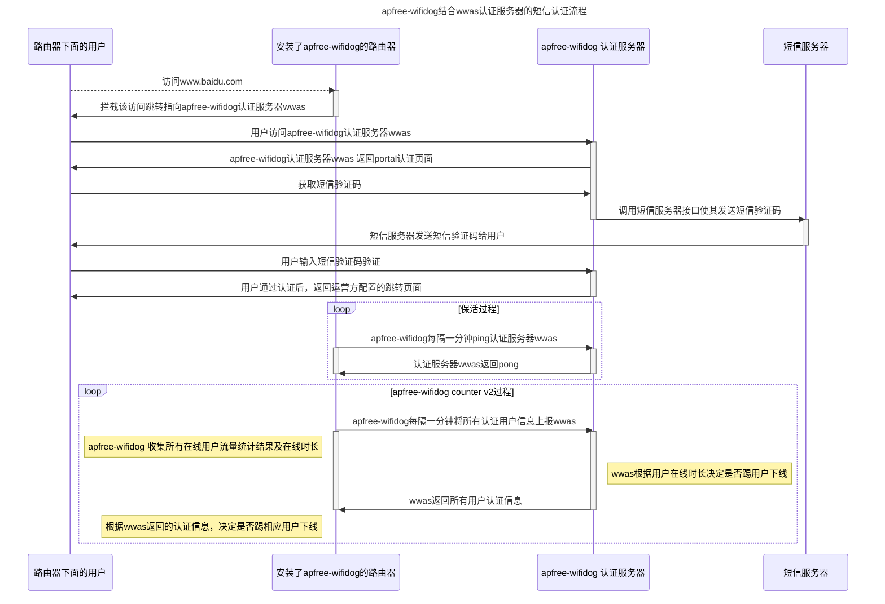
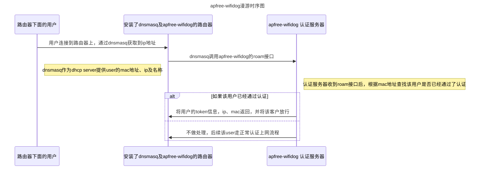

[![license][1]][2]
[![PRs Welcome][3]][4]
[![Issue Welcome][5]][6]
[![Release Version][7]][8]
[![OpenWRT][11]][12]
[![Join the QQ Group][15]][16]

[1]: https://img.shields.io/badge/license-GPLV3-brightgreen.svg?style=plastic
[2]: https://github.com/liudf0716/apfree_wifidog/blob/master/COPYING
[3]: https://img.shields.io/badge/PRs-welcome-brightgreen.svg?style=plastic
[4]: https://github.com/liudf0716/apfree_wifidog/pulls
[5]: https://img.shields.io/badge/Issues-welcome-brightgreen.svg?style=plastic
[6]: https://github.com/liudf0716/apfree_wifidog/issues/new
[7]: https://img.shields.io/badge/release-3.11.1716-red.svg?style=plastic
[8]: https://github.com/liudf0716/apfree_wifidog/releases
[11]: https://img.shields.io/badge/Platform-%20OpenWRT%20-brightgreen.svg?style=plastic
[12]: https://github.com/openwrt
[13]: https://img.shields.io/badge/KunTeng-Inside-blue.svg?style=plastic
[14]: https://www.kunteng.org.cn
[15]: https://img.shields.io/badge/chat-qq%20group-brightgreen.svg
[16]: https://jq.qq.com/?_wv=1027&k=4ADDSev

## ApFree WiFiDog: A high performance captive portal solution for HTTP(s)

ApFree WiFiDog is a high performance captive portal solution for HTTP(s), which mainly used in [Openwrt](https://github.com/openwrt/openwrt) platform. 

## Sequence diagram

## Enhancement of apfree-wifidog 

In fact, the title should be why we choose apfree-wifidog, the reason was the following: 

>  Stable

apfree-wifidog was widely used in tens of thousands openwrt device, which has run in business scene. In order to improve its stable, we rewrite all iptables rule by api instead of fork call, which will easily cause deadlock in multithread-fork running environment. we also re-write the code and replace libhttpd (which unmaitained for years) with libevent2

> Performance

cause libevent2 support epoll, apfree-wifidog has better performance than original wifidog, there are some benchmark data in 
benchmark directory to prove it

> HTTPs redirect

apfree-wifidog support https redirect, in current internet environment, captive portal solution without supporting https redirect will become unsuitable gradually

> More features

apfree-wifidog support mac temporary-pass, ip,domain,pan-domain,white-mac,black-mac rule and etc. all these rules can be applied without restarting wifidog

> MQTT support

by enable mqtt support, u can remotely deliver such as trusted ip, domian and pan-domain rules to apfree wifidog 

> Compitable with wifidog protocol

u don't need to modify your wifidog authentication server to adapt apfree-wifidog; if u have pression on server-side, apfree wifidog's improved protocol can greatly relieve it, which disabled by default

----

## How to added apfree-wifidog into Openwrt package 

apfree-wifidog has been accepted by OpenWrt packages' master and 19.07 branch, which can be found in net directory.

--------

### Attention! when apfree-wifidog redirect https request, u will receive certificate file is illegal warning, no need to panic, it's normal response

### apfree-wifidog Auth server open source project

apfree wifidog's official auth server is [wwas](https://github.com/wificoin-project/wificoin-wifidog-auth-server), which support wfc pay and weixin auth-mode and more auth-way will be support.

### demo pic

 

### demo video

http://www.iqiyi.com/w_19s09zie6t.html

**More auth server please read [AUTHSERVER.md](https://github.com/liudf0716/apfree_wifidog/blob/master/AUTHSERVER.md)**

### How To Contribute

Feel free to create issues or pull-requests if you have any problems.

**Please read [CONTRIBUTING.md](https://github.com/liudf0716/apfree_wifidog/blob/master/CONTRIBUTING.md) before pushing any changes.**

### contact us 
QQ group： [331230369](https://jq.qq.com/?_wv=1027&k=4ADDSev)

---
